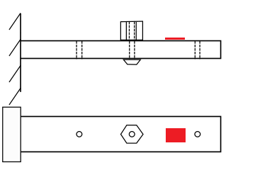
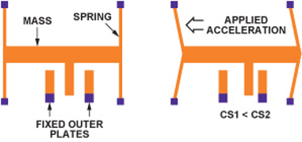

# Lab 5 - Mass Measurement Device with Cantilever beam

## Introduction

It is usually the case that we wish to use the results of a simulation or experiment to form a predictive model of some physical 
phenomenon. In this lab, you will use FEM simulation to produce a predictive model that describes the variation of the natural 
frequencies of a cantilevered beam in response to an applied point mass. Using this model, you will determine the mass of an object
attached to your real-world beam by observing the changes in the beam's natural frequencies.

## The Mass Measurement Device

You will apply many of the skills you have learned over the previous weeks. With your knowledge of FFT, linear regression, 
and FEM modal analysis, you will develop and implement a method to measure the mass of an object. Your measurement device will be your
cantilevered beam, and you will observe the changes in its natural frequencies that result from attaching the object to various pre-
defined points on the beam (Figure 1). From these frequency changes, you will deduce the unknown mass.

*Figure 1: Diagram of cantilever with unknown mass in position 2 out of 3 total
positions. The red area indicates the placement of an accelerometer.*

An accelerometer will provide the data describing the motion of the beam. This type of sensor employs a micron-scale spring-mass 
system (Figure 2). When under acceleration, this mass moves relative to a set of fixed plates, inducing a change in capacitance. This
change is proportional to accleration.

*Figure 2: Micron-scale sensor used in accelerometers. Under acceleration, the change in capacitances CS1 and CS2 will be
proportional to the acceleration.*

# Mass measurement contest

There are multiple valid approaches to solve this problem, and it is up to you and your partner(s) to find a procedure you think will
produce an accurate estimate of the unknown mass.

Each group's results will be entered into a contest, with the most _accurate group_ and the most _precise section_ receiving prizes.

**Rules of Contest**

1. The masses must not leave the lab.

2. You may not mount other known masses to the cantilever, or use any mounting point other than the three pre-dilled holes.

3. You must report your uncertainty in your mass measurement to enter the competition. In other words, your estimate of your
mass must include a confidence interval.

4. You must report the serial number of your mass (i.e., "TJM 01-TJM 12") to enter the competition.

5. You may use the following tools and software: accelerometer, calipers, ruler/tape, Ansys, SolidWorks, Labview, Python, Matlab, and 
Excel. 

6. It should go without saying that you may not weigh your mass.

_Note: This is intended to be a friendly competition on top of a normal lab assignment. Poking around to find loopholes will 
disqualify you, and could also earn you a poor grade for not following the lab procedure._

**Winners of the contest**

There will be two sets of winners for the contest:

1. Lab group with the most accurate mass measurement calculated with
$A=|m_{reported}-m_{actual}|$

2. Lab section with the most precise mass measurement calculated with
$P=\frac{\sum_{i=1}^{N}(m_{reported}-m_{actual})^2}{N}$

Where $A$ is the accuracy, $P$ is the precision, $m_{reported}$ is the reported
mass from your experiment, $m_{actual}$ is the actual mass of the object,
and $N$ is the total number of lab groups in a section. The group and section
with smallest $A$ and $P$, respectively, will win prizes. The prizes are:

1. Each member of the winning lab group will receive a **\$25 gift card** of their choice.

2. **Donuts** will be brought to the winning section.

Note - due to smaller section sizes, sections 004L and 008L will be grouped as one section for the purpose of calculating $P$, as will 
sections 001L, 011L, and 014L.

## Deliverables (Please note the changes)

For this assignment, you will have two weeks in the lab. You and your lab partner will submit a **joint** report as a .pdf to your 
HuskCT section within **one week** of your final lab date. It will only be necessary for one of you to submit the report. Please 
clearly mark, either in the body as footnotes or in the appendix as a separate section, what each of you contributed to the report.

You are limited to **6 pages** and **5 figures**. Additional data, figures, and information can be put in an appendix. The appendix 
will not be graded, but you may refer to it to explain data, methods, or other relevant information.