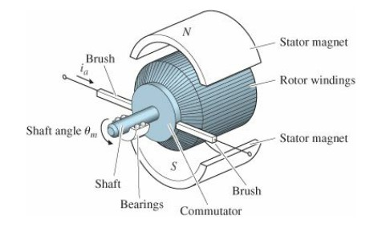

# Lab 6 - DC Motors and the Step Response of First Order Systems

## First Order Systems

A first order system is a system whose dynamic response can be described by a first order differential equation. There are countless
examples of such systems - RC circuits, interest accumulation, population models, emptying rates of fluid tanks - and all of them can be
represented by an equation of the form:

$\tau\frac{dy}{dt}+y=kF(t)$      (1)

where $\tau$ is the *time constant* which describes the dynamic behavior of the system, $k$ is the *steady-state gain* which describes
the system's steady-state behavior in relation to its input, and $F(t)$ is the forcing function or input disturbance. For a given
$F(t)$, knowledge of $\tau$ and $k$ will enable prediction of the system behavior.

## DC Motors

DC motors are devices which take in a continuous direct current and output rotary motion. In a permanent magnet DC motor, stationary permanent magnets (called stators)
surround a coil of wire (called the armature) that is carried by the rotor (the rotating portion of the DC motor) (Figure 1). When a 
current flows through the armature, a magnetic field is induced. The presence of the magnetic field from the stators causes the rotor to 
turn in response to the magnetic field induced by the armature. To transfer current to the moving rotor, brushes make electrical contact 
with a piece of the rotor called the commutator. The commutator is wired to regularly flip the direction of the armature current to 
enable continuous motion.

*Figure 1: Schematic of a DC motor*

The response of a DC motor to an applied voltage can be described by a first order system:

$\tau\frac{d\Omega}{dt}+\Omega=ke_i$    (2)

where $\Omega$ is the angular velocity (rad/s) and $e_i$ is the voltage applied to the armature (V).

## Step Response, time constant, and system parameters

In this lab, you will observe the response of a DC motor to a voltage step input (i.e., a sudden change in applied voltage from $0$ to 
$e_i$). Using this response, you will be able to determine the motor's time constant, as well as system characteristics such as 
rotational inertia and damping coefficient. Additionally, constants describing the characteristics of the motor will be calculated from 
your observations.

## Deliverables

For this assignment, you will have **one week in the lab**. You and your lab partner will submit a __joint report__ as a .pdf to your HuskyCT section within __one week__ of your final lab date. It will only be necessary for one of you to submit the report. Please clearly mark, either in the body as footnotes or in the appendix as a separate section, what each of you contributed to the overall report.

You are limited to __5 pages__ (not including the title page, references, or appendix) and __4 figures__. Additional data, figures, and information can be put in an appendix. The appendix will not be graded, but you may refer to it to explain data, methods, or other relevant information.